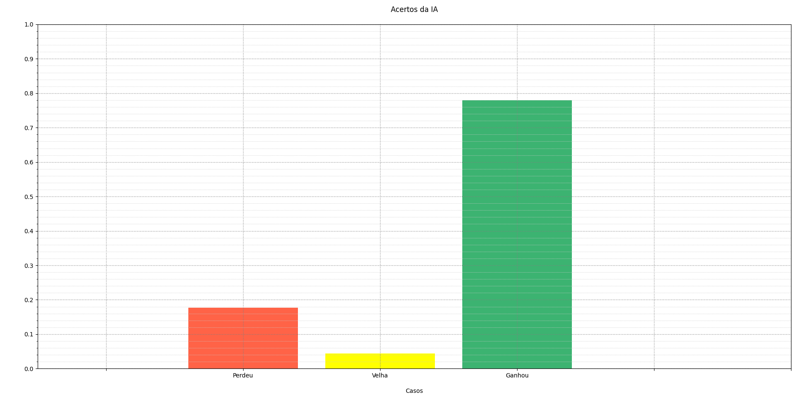
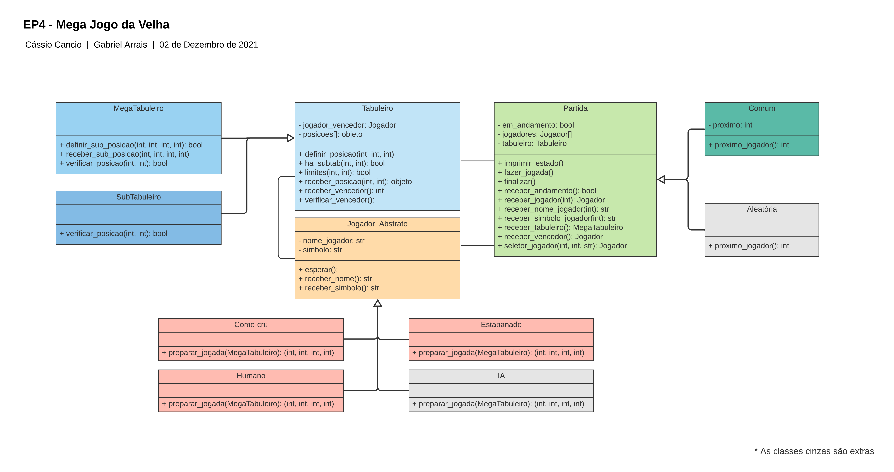
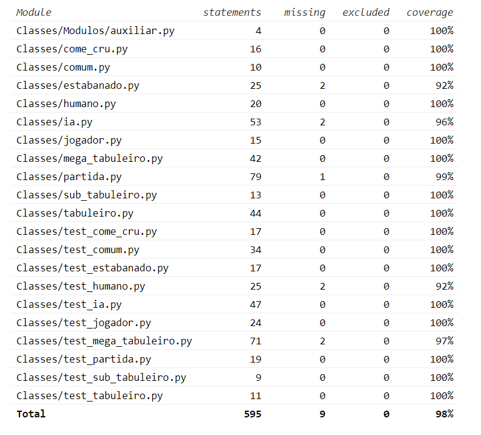
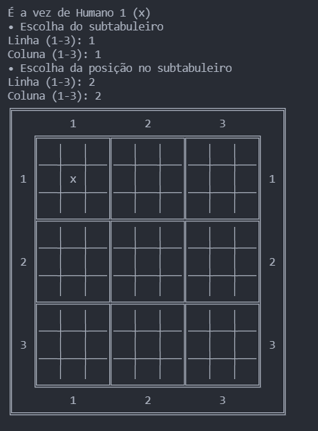

# MAC0216 - EP4 Mega Jogo da Velha
Integrantes |nUSP
-- | --
Cássio Azevedo Cancio | 4818166 
Luiz Gabriel Lima Arrais | 12543523

Este repositório foi criado com o objetivo de registrar e armazenar o EP (Exercício Programa) de Programação Orientação a Objetos em Python, dado durante a matéria de MAC0216 em 2021 no IME-USP. O projeto consiste na produção de um Mega Jogo da Velha, no qual cada casa do tabuleiro é um tabuleiro menor, como ilustrado abaixo:

Para ganhar o jogo, o jogador precisa ganhar 3 subtabuleiros que formem uma linha reta. O programa possui dois tipos de partida:

* Comum - na qual os jogadores revezam entre as jogadas;
* Aleatória - na qual os jogadores são escolhidos aleatoriamente para jogar, o que torna o jogo mais divertido. 

Além disso, existem 4 tipos de jogadores:

* Come cru - o computador joga sempre na casa primeira casa vazia do primeiro subtabuleiro disponível;
* Estabanado - o computador sorteia uma posição e a marca;
* Humano - para que uma pessoa possa digitar as posições a serem marcadas;
* IA - primeiramente, o computador escolhe o subtabuleiro onde a IA possui menos jogadas que seu adversário. Se esse tabuleiro não for encontrado, ela seleciona o primeiro disponível. Depois disso o algoritmo segue as seguintes regras, respectivamente:
  1) Se a posição central estiver livre, jogue nela.
  2) Se o inimigo marcou alguma posição de canto central, ou seja, norte, sul, leste, oeste, jogue nas diagonais
  3) Se não achar posição de canto central marcada, seleciona alguma posição aleatória.

Gráfico de comparação IA x Estabanado (a IA vence em 78% dos casos considerando 1000 partidas)

### Organização, classes e testes
Para facilitar o desenvolvimento do programa, primeiro foi criado um diagrama de classes para representar os atributos e métodos que cada classe precisaria ter. O diagrama está na imagem a seguir:

Os testes automatizados foram criados com pytest visando cobrir a maior quantidade de casos possíveis, assim, o programa teve 98% das linhas testadas, o que ajudou a encontrar e evitar bugs. É possível rodar os testes automatizados digitando *pytest* dentro da pasta do repositório no terminal de um sistema com essa biblioteca

Cobertura dos testes

### Uso do programa

Para usar o programa, é necessário rodar o comando *python main.py* dentro da pasta *Classes*. Em seguida, o programa mostrará os modos disponíveis e os tipos de jogadores. Para selecionar, basta digitar o número correspondente da opção. Exemplo:

Caso o usuário tenha escolhido apenas jogadores operados pela máquina, o jogo se iniciará pausando por 2 segundo a cada rodada para que o usuário possa ver as jogadas sendo feitas. No caso de ser escolhido o jogador humano, o jogo pedirá ao usuário que digite as posições do subtabuleiro desejado, depois da posição dentro do subtabuleiro. Exemplo:

As jogadas devem ser feitas. Quando o resultado estiver determinado, o programa encerrará a execução, anunciando, se houver vencedor, quem foi e, se não houver, anunciará que o jogo deu velha. Enfim, esse é o jogo, boa diversão 🙂
