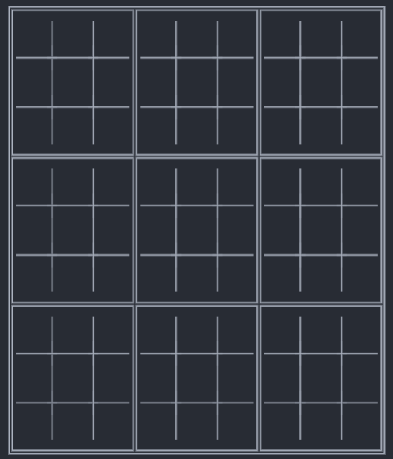

# MAC216 - EP4 Mega Jogo da Velha
Integrantes |nUSP
-- | --
Cássio Azevedo Cancio | 4818166 
Luiz Gabriel Lima Arrais | 12543523

Este repositório foi criado com o objetivo de registrar e armazenar o EP (Exercício Programa) de Programação Orientação a Objetos em Python, dado durante a matéria de MAC0216 em 2021 no IME-USP. O projeto consiste na produção de um Mega Jogo da Velha, no qual cada casa do tabuleiro é um tabuleiro menor, como ilustado abaixo:

Para ganhar o jogo, o jogador precisa ganhar 3 subtabuleiros
